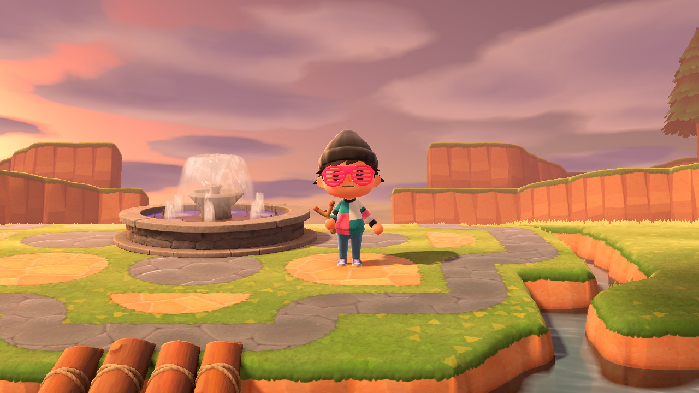
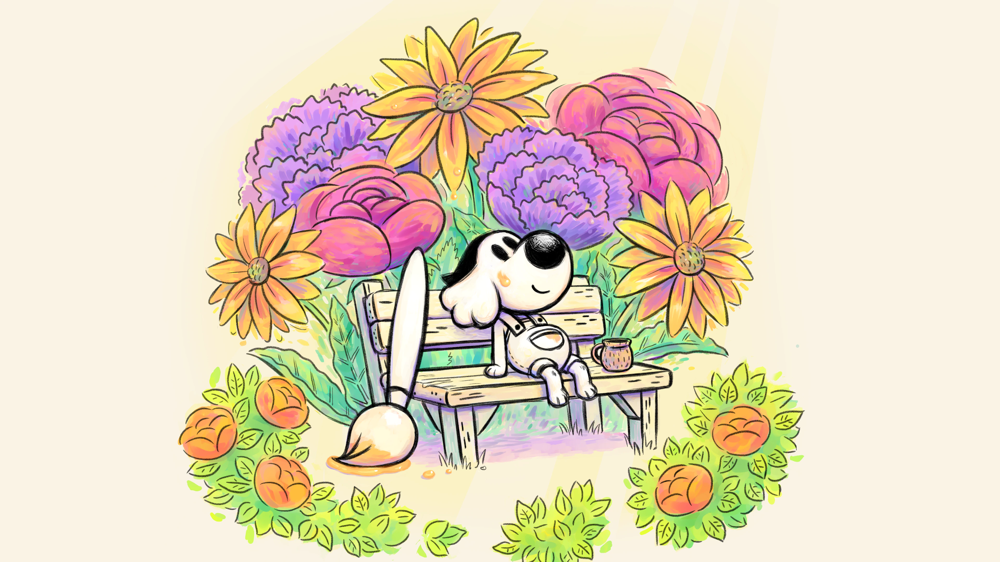
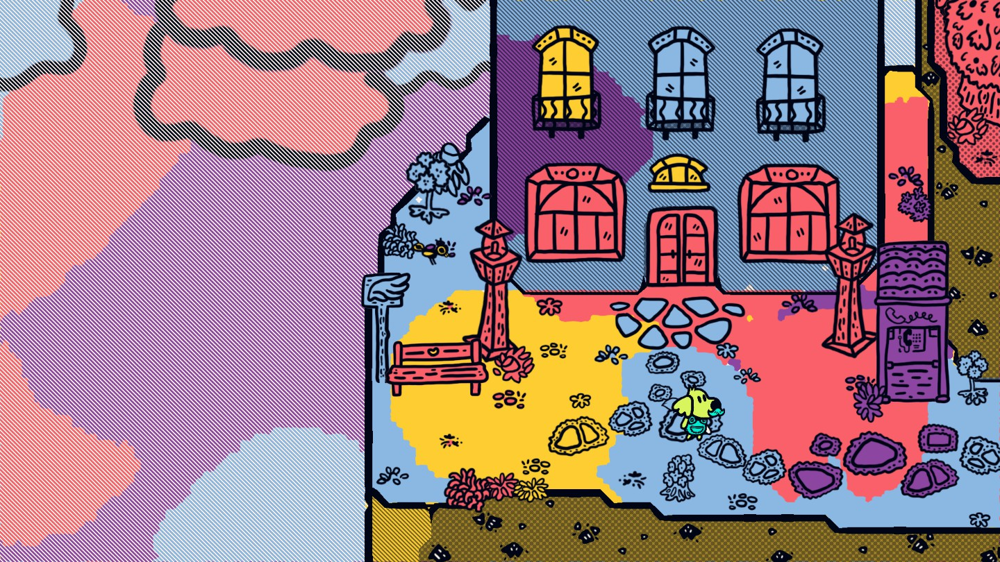
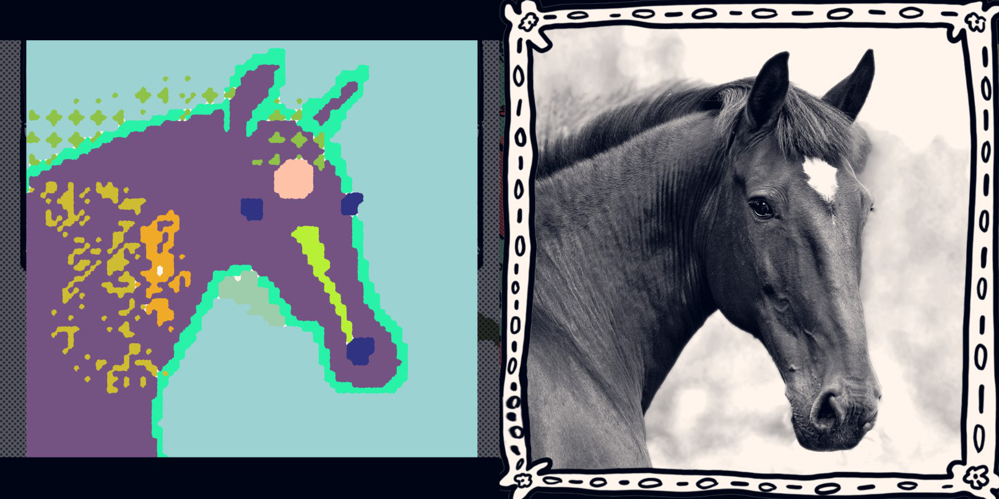

While the heydays of Minecraft dominating the gaming world are mostly gone, over the past few years, we've slowly seen the resurgence of games that let you express highly creative aesthetic visions. Cities: Skyline has gained popularity as the most complete city building simulator in years. Roblox has built an excellent marketplace while evolving the level building capabilities of games like Little Big world. Animal Crossing: New Horizons captured the hearts of cozy gamers everywhere with its continually growing collection of villagers and island decorations.

The communities of each of these games has shown time and time again that grand creations can be made and that long term fandoms can be sustained off of just user creations. However, a lot of these games suffer from the same problem. While it's amazing to go through Youtube and forums and browse through a plethora of amazing creations, it's much harder to make those creations on your own. Like any highly polished creative endeavor, it takes a lot of time to iterate through ideas and narrow them down to something that works, and it's hard to bridge that gap for someone who doesn't really know where to begin. Furthermore, game design may not always help the problem. Oftentimes, many building materials and tools are either hard to obtain or locked behind hours of grinding. While this additional time input makes certain builds even more of an accomplishment, it also can deter new players who just want to build what they saw their favorite Youtuber make.

I've certainly had my own share of struggles with this chasm between attempted output and the building process to get there. In early pandemic days, I got caught up in the mania of Animal Crossing: New Horizons. Within a month, I'd paid off my loans, caught all available bugs and insects, and accumulated a sizeable reserve of bells. I was all set to start turning my island into the resort of my dreams. I even printed out a screenshot of my map to do some light urban planning by hand. I had a crystal clear idea of which villagers I wanted, where they'd live, and what decor they'd be surrounded by.

Armed with my vision, I got to work. I spent hours terraforming my land, started accumulating DIY recipes and raw materials, and even dabbled in the various bootstrapped online trading systems. I was certain that I'd be able to complete my vision within a few weeks. And then, like many others, I just stopped. I deserted my island and left my villagers wondering why I left half a stegosaurus by their house. I didn't quit the game because I didn't know what I wanted to do. Rather, I quit because I didn't think the path there was worth the expected satisfaction of my dream island. I didn't think my creation in my head was worth the weeks of DIY mongering, villager searching, and material gathering.

I don't think my experience is unique. Spend any amount of time in discord servers or forums for these kinds of creative games, and you'll hear numerous stories of unfinished projects, unrealized ideas, and unsatisfied creatives. I think this phenomenon stems from a very understandable facet of artistic creation - perfectionism. Getting your work to a state where you're willing to show it off to other people is incredibly hard to do both creatively and psychologically, and it is certainly much easier to give up and save yourself the effort. Ultimately, it can be hard to combat laziness when there are so many other things to do with your time, especially when it becomes abundantly apparent that there are a ton of truly talented makers who can make things you'd only dream of making.

But earlier this month, a game came out that took on this problem in fresh new ways. [Chicory: A Colorful Tale](https://chicorygame.com/) was a game I was hyped for as soon as I heard about it due to its star-studded team which had previously worked on games like Wandersong and Celeste. Chicory follows the tale of Pizza, a janitor who is forced to become the savior of the world after picking up a magical paintbrush. After a mysterious incident, the entire kingdom of Picnic has been wiped of color, and it is up to Pizza to fill in this new blank slate while defeating the evil that caused it.

The gameplay of exploring Picnic itself is on its own incredibly compelling. The world map consists of 2D Zelda-like screens, but the twist is that each screen is it's own coloring book. As you navigate the world, you can use your brush to color in each screen. From a Metroidvania inspired locks and keys perspective, your paint allows you to reach new areas and open up new paths. More importantly though, coloring in each screen is simply a lot of fun. Chicory provides a diverse color palette unique to each area as well as various stamps and patterns, allowing you to truly customize each and every screen of the world to your liking. You can fill a bustling forest with neon pink trees and polka dotted floors, and you can turn an icy mountain into a pastel paradise. The world is literally yours to fill in.

However, because Picnic is such a vast landscape, over time, I learned that I couldn't spend too much time in each individual screen, or else I'd never get to experience the rest of the game that was teased to me. I'd never be able to explore that new town my sister Clementine told me about, and I'd never be able to visit the Wielder's Temple that promised to reveal the history of the brushmasters that preceded me. As a result of this forward momentum, I instead used the game's tools which enabled me to paint wider swaths of each screen. I'd dole out colorful blots or stamp the screen with tens of music notes before moving on to the next, where I'd perhaps choose to use a different color palette or use heart shaped stamps instead. By the end of my game, my map of Picnic was far from a cohesive vision of what I wanted the world to look like. Instead, it was a catalogue of whatever patterns I subconsciously desired in the moment, forming a trail of my journey. But when I viewed the entire map, it still looked absolutely beautiful.

Exploration isn't the only way Chicory encourages you to be satisfied with less-than-ideal creations though. After a few hours in the game, you come across an art school. The format of this minigame is quite unique - you're presented with various masterworks of the in game world, and you're told to recreate them to the best of your ability. After a single glance at the masterwork, it becomes obvious that I wouldn't be able to create anything of that quality with just the mouse and keyboard controls. As a result, I did my best to create something that I myself would be satisfied with, and after submitting my creation, I was treated with a very pleasant surprise. The other students in the art class "critique" your art, but they only give compliments. They talked about how I really conveyed the weightiness of the setting or how they appreciated my choice of dark purple in the background. As the player gets further and further in the minigame, the underlying lesson reveals itself. Everyone has their own artistic style, and there is value in sharing that with others and seeing how they interpret it, regardless of quality. I knew my drawings weren't the best aesthetically, but I'm proud of the effort I put into them, and that's enough sometimes.

Chicory drives this lesson home in one final way - through the story. The following section will contain spoilers, so read at your own caution. Throughout the story, Pizza struggles with questions of why they should be the one to wield the brush. They know they were just a janitor who happened to be in the right place at the right time, and so when the onus to save the world is actually thrust upon them, they understandably question whether they are the best person to fix the problem. In the climax of the story, Pizza gets the brush stolen away from them by the final baddie, and they are left dejected as they walk home to their friends and family, knowing that they've lost the battle and that the world will end. However, after a bit of introspection, Pizza realizes they can create a new brush from their will to paint, and armed with a new tool, they defeat evil and restore color to the world. This time though, there's a twist. They tell everyone that they can create a brush too, and they commit themselves to establishing a world where everyone has a right to self expression, not just semi-arbitrarily chosen masters. The lesson is simple - yes, some people are more talented at artistic endeavors than others, but that doesn't mean that the less talented shouldn't share their work. Quick sketches and paint jobs still have the power to elicit emotional responses, and we should encourage everyone to create, no matter how unpolished the outcome is.

I think in future creative games I play, I won't let grand visions or long-term projects prevent me from playing the game and having fun. There's joy to be found in smaller creations and experimental tests, and there will always be time to engage in something larger if I feel confident enough to do so. The fast-paced creative energy of Chicory provided me with some of the most interesting gameplay I've experienced in years, and I hope I can take its lessons with me to other games and endeavors.