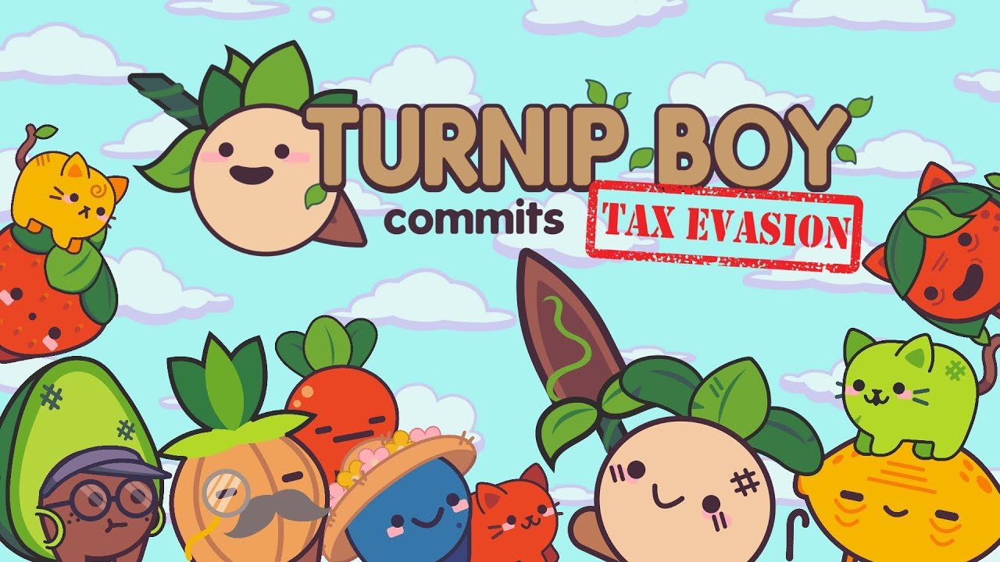
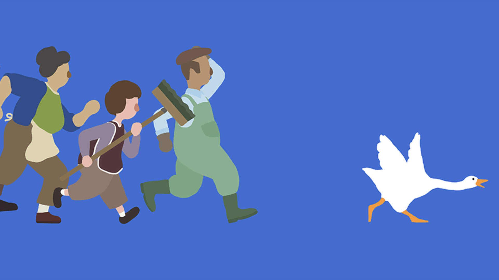
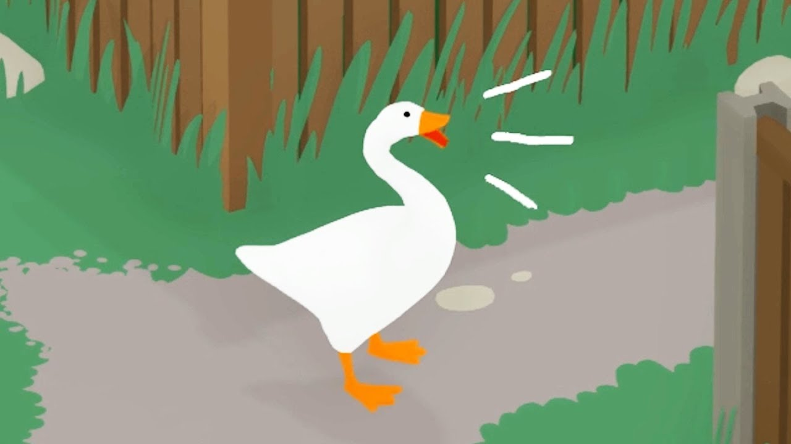

Virality is surprisingly elusive for something which dominates so much of internet discourse. It's hard to reason about what generates the Twitter topic of the day. There often isn't anything inherently important or discuss-able about bean dad or silk press Ryan Gosling, but these things blow up in a way that makes everyone want to add their own awful take on the situation.

Within the video game world, one such meme that has been picking up traction is the release of *[Turnip Boy Commits Tax Evasion](https://playturnipboy.com/)*, made by Snoozy Kazoo. The very name of the game itself has made many folks purchase it, and the promotional content leading up to the release had also generated a reasonable amount of hype. The title is clearly inspired by [Yoshi's adventures in tax fraud](https://www.youtube.com/watch?v=Oc8vrGjyqes), and the various vegan-friendly characters seem designed to be mass produced as keychains and plushes. In other words, the game seems tailor made to match many of the gaming community's current sensibilities - weird enough to create buzz but cute enough to create a sense of endearment.

I by no means was immune to the hype. I pre-ordered the game, incentivized by a small discount, and I binged through the game in one sitting. That's not saying much - a 100% playthrough took less than three hours, but I was clearly invested enough in the mythology around the game and its release to consume it as soon and quickly as possible. In hindsight, that was a huge mistake. I was left feeling incredibly hollow. Not because the game was short, but rather because the game seemed to lack substance. It played like shovelware with a layer of internet relevance lazily glazed on top.

My experience with *Turnip Boy* heavily contrasted my last fond memory of a notable meme game. When House House's *[Untitled Goose Game](https://goose.game/)* released in 2019, I was hyped for many of the same reasons. Promotional content leading up to the release had emphasized the quirky nature of the game and its mechanics, and the art style was similarly adorable in a very merchandisable way. However, my memories of playing that game are significantly more positive. The game was of a similar length, but the playthrough was filled with small moments of joy. It was a quality game in itself, and the meme-able nature of it was an extra layer on top.

This vast difference between my experiences with the two games led me to think about what makes a good meme game. On paper, the two games are praised for similar things - joyful art, a bopping soundtrack, and fun-enough gameplay. *Untitled Goose Game* carries an air of cohesive levity though. The developers thought deeply through what people would do if suddenly transplanted into the body of a goose, and it shows in the tiny layers of polish. The dynamic soundtrack adds a heist-like quality to player actions. The addition of relatively useless movements like flapping and honking make simply existing as the goose more fun. The world feels lived in, with human characters having individually decorated garages and yards. Yes, the game is a giant joke, but the developers commit to the joke.

*Turnip Boy* on the other hand feels like a bunch of cobbled together references. There are jokes that resonate with internet denizens, such as the gifting of a Tier 3 sub in a sidequest and the anime waifu drawing of Turnip-chan, but most of these jokes are disconnected and don't tie into any central theme outside of being generic collectibles. The first few key game mechanics show promise, but the developers can't help but sneak in a portal ~~gun~~ flower to show that they are aware of a very popular game. And worst of all, the tax evasion theme ends up having nothing to do with the game - it merely serves as the inciting incident for a story that is all over the place. *Turnip Boy* shows that it is incredibly aware of everything going on in popular gaming culture, but it adds nothing to the conversation.

Despite all my complaints, I still enjoyed my time with *Turnip Boy*. The puzzles were novel, the enemies felt unique, and the boss fights were surprisingly almost difficult. However, I was really hoping for something unique instead of another 2D Zelda clone. I was looking forward to learning about various tax loopholes from gurus being hounded by the IRS. I was hoping for a raid on the in-game version of TurboTax. I wanted to explore a tropical tax haven populated by mountains of cash. There are so many potential directions to go when making a game about tax evasion, but *Turnip Boy* pursues none of them.

I don't blame the developers for that - true creativity is hard. Rather, I blame myself for expecting too much. As a consumer, it's easy to get suckered in by something which seems to understand jokes from my in-groups. But understanding and referencing existing jokes is easy. You can pull out a notebook and cobble together a trove of bad ones in less than a day. Combining these jokes into a single narrative is a harder challenge, and creating entirely new subsets of hilarious meme-ery is even more difficult. *Untitled Goose Game* wasn't afraid to tread new waters and potentially strike out, and after playing through *Turnip Boy*, I'm so much more appreciative of everything House House accomplished.

