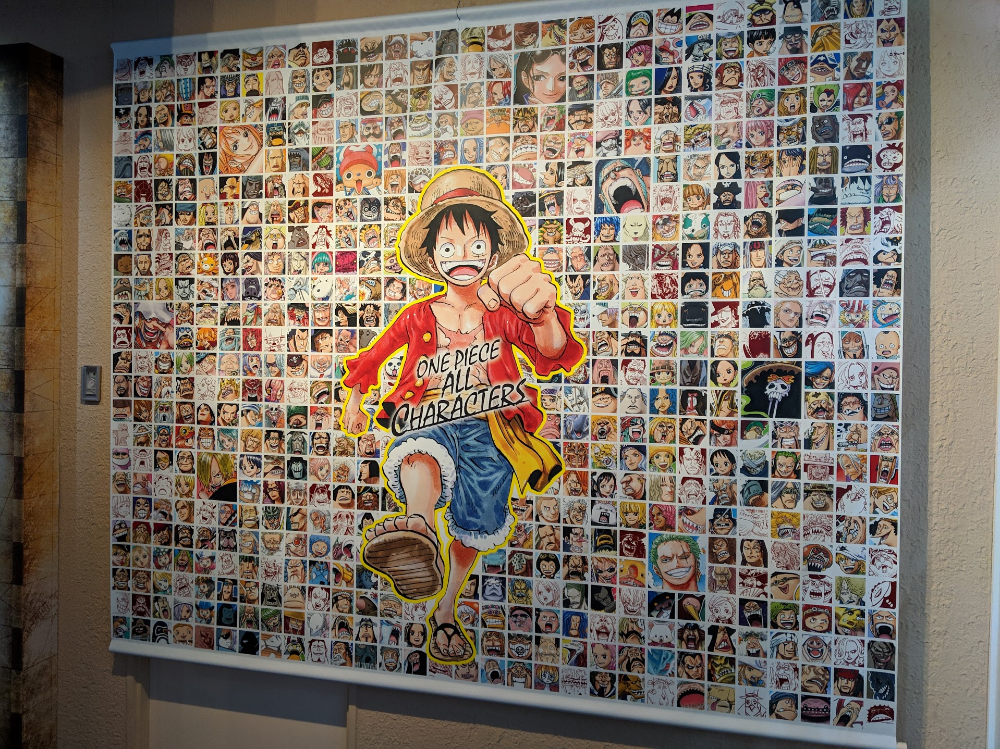
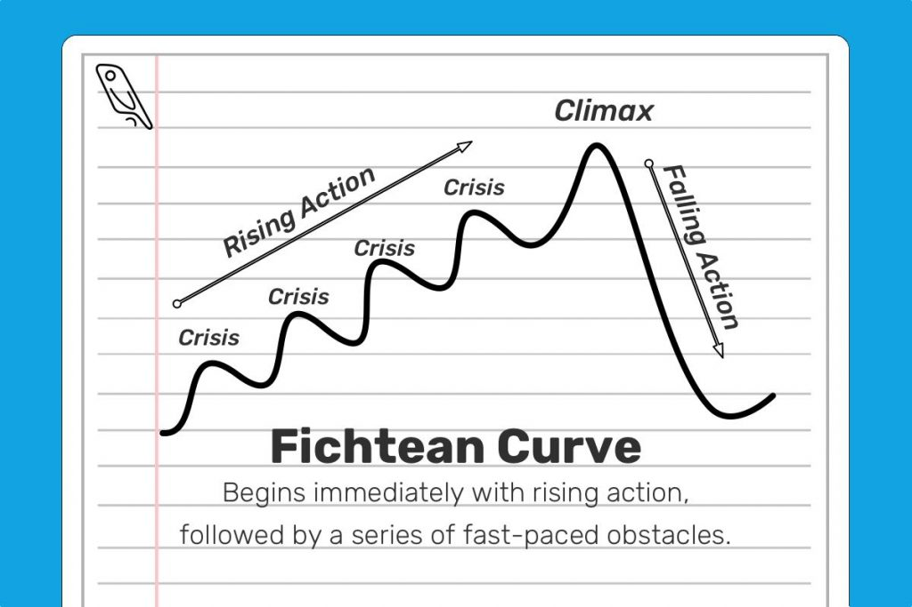
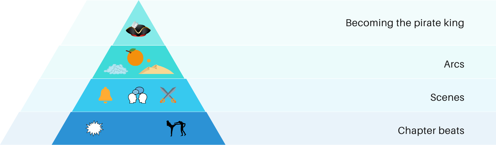
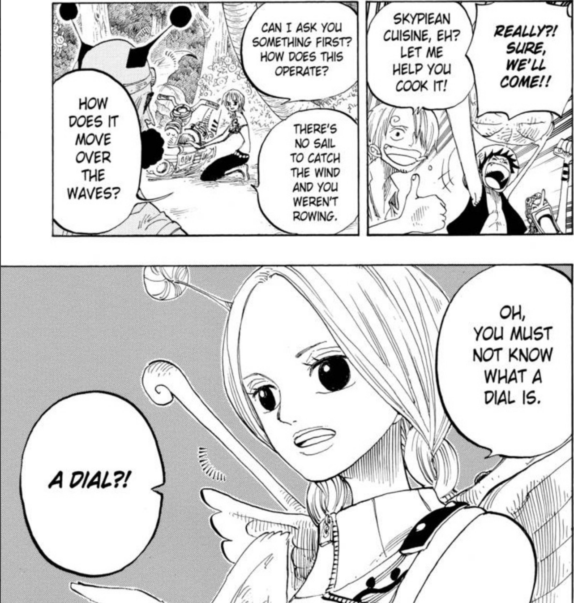
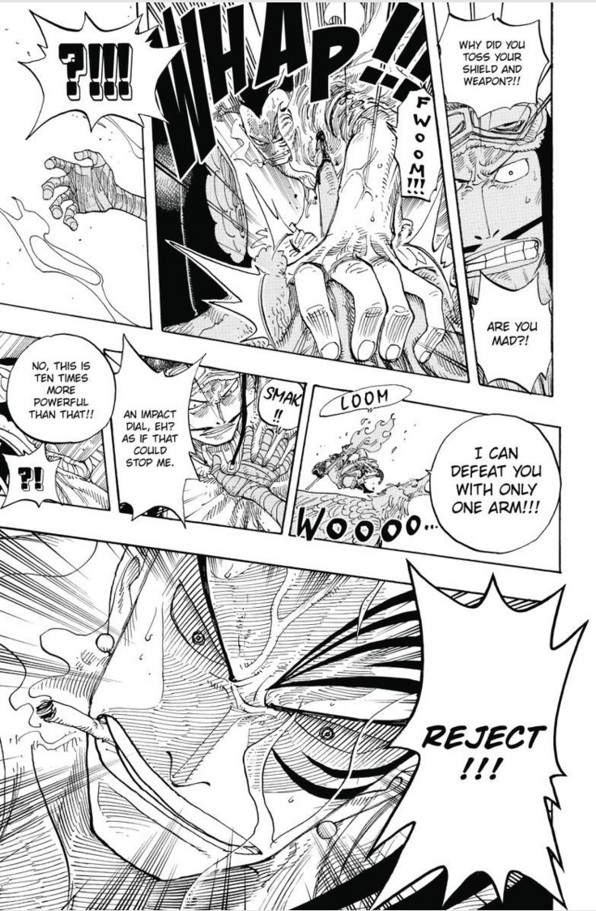
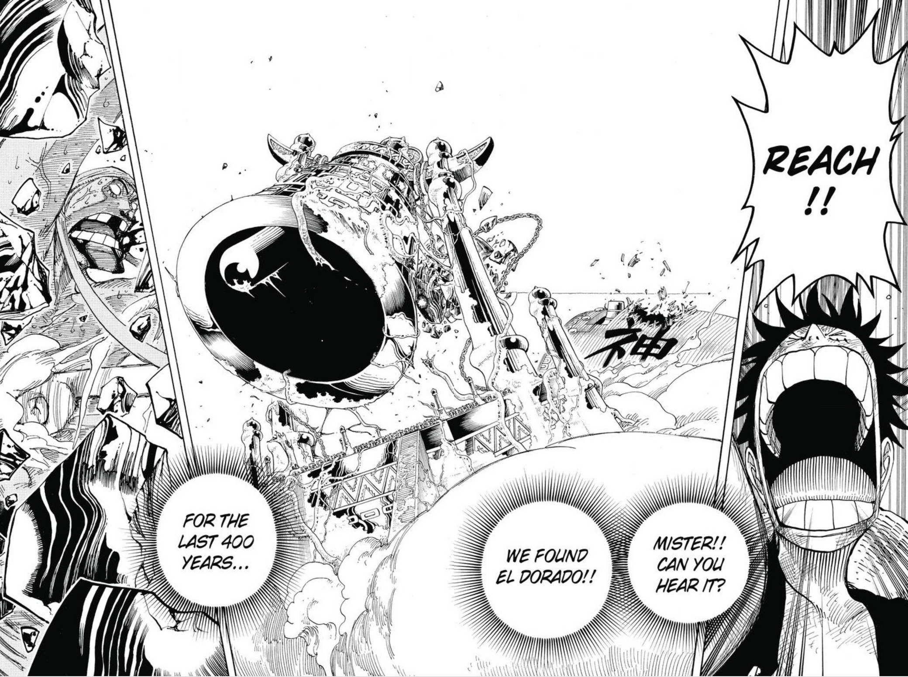
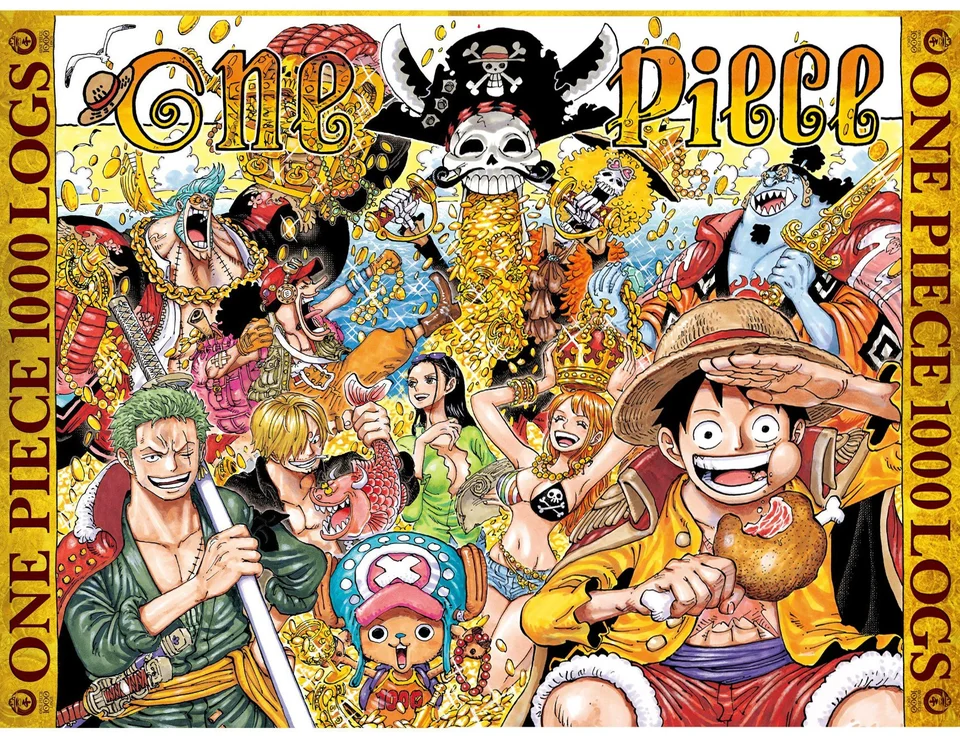

##### Warning: One Piece spoilers ahead

One Piece first debuted to the world in Weekly Shonen Jump #33 - July 22, 1997. In 20+ years since then, we've accompanied Eiichiro Oda through a fantastical journey full of imaginative wildlife, fleshed-out nation states, and bombastic characters. Oda's efforts hit a major milestone when Chapter 1,000 came out on Jan 3, 2021, 8,566 days after Chapter 1. And while the narrative has certainly delivered an abundance of action-packed fights, hilarious gags, and tear-inducing character moments over the past two decades, the chapter reiterated that One Piece is still the same story at its core - an argument for the power of hopes and dreams and their ability to inspire good people even in a brutally dangerous and overwhelmingly corrupt world.

This simple theme has been reframed for me many moments throughout my life. I've been reading One Piece ever since the OneManga days of 2006, bouncing from scanlation to scanlation as different sites faced a variety of legal issues (though I now read through the [official Viz website](https://www.viz.com/shonenjump/chapters/one-piece)). The haunted mansion of Thriller Bark served as a backdrop to my final elementary school Halloween party. The summer before I started high school, One Piece went on a month-long hiatus before the timeskip, and I hungrily reread the entire series, unable to stop thinking about the fate of Luffy and his friends. The week before I graduated from college, Luffy was proclaimed the Fifth Emperor after escaping from Big Mom. At many seminal moments of my life, One Piece has provided a sense of optimism, or at the very least, a source of escapism in what has become an increasingly tumultuous world both at a personal level and a global level.

I'm certainly not the only person whose life has been shadowed by the series. One Piece has been at the forefront of the rise of anime as a respectful medium, and it has been a consistent presence in the surge in interest in adjacent fields such as fan conventions and cosplay. People have had One Piece themed weddings with officially licensed wedding dresses. Tokyo Tower was transformed into a One Piece theme park complete with life-sized statues and interactive attractions. The scale of this impact simply makes sense though - you can't have a series go on for so long and be so commercially successful without having a sizable number of rabid fans. And credit has to be given to Oda for creating a series that inspires such intense emotions for these fans and sustaining the quality over decades.

A lot has been written about the aspects of One Piece that lend to its longevity - the world building, the epic nature of the initial quest, or perhaps just inertia. However, one thing I don’t think gets enough attention though is just how well Oda constructs his narrative beats around the serialized format of manga. In more traditional mediums, such as films or novels, the atomic storytelling element is the scene. Characters come together with different motivations or states of mind, and the conflict or conversation creates forward momentum for the plot. The beats of rising action, climax, and falling action are all given ample time to play out. In a traditionally formatted story, the summation of all of these moments themselves lend to a larger scale plot structure, with some scenes creating rising action or conflict and other scenes resolving prior conflicts or hanging threads.

In serialized mediums, such as comic books or long-running television, many of these tenets still hold true. Within an episode or chapter, there is usually sufficient space to create a complete narrative that still builds up to a larger plot thread. However, one important new element is introduced - the cliffhanger. The conclusion of an episode typically introduces some new unresolved question that will be resolved in the next episode in order to get the consumer to come back. Unlike a novel or a Netflix special, the viewer does not usually have the option to immediately go onto the next section and resolve this open question. They’re instead forced to think through the question during the weeks or months before a new release, dwelling over the possibilities.

This suspense already creates an effective recurring subscription-like loop, but manga takes this principle to a whole new level with it’s own set of incentives and limitations. Because chapters are typically quite short in a weekly serialization, usually around 20 pages or so, there isn’t really time to flesh out an entire scene, with a typical scene being 1-3 chapters. Instead, narrative beats must be constructed around more spliced elements, such as a short exchange of conversation or a simple sequence of thrown punches. Within a scene, a mangaka can’t follow traditional plot structure. They must embed tiny beats throughout the scene, with each beat having a sufficiently compelling cliffhanger.

To explain more concretely, traditional mediums can get by having a two tiered story system. Scenes form the bottom tier, with each scene having its own plot structure. At the top tier, there’s the overall story or arc, with each scene contributing to a larger conflict. For larger-scale stories, there can be another tier above, with arcs contributing to long-lived themes throughout a story. But for manga, In addition to these traditional tiers, there’s a tier below, with individual beats of scenes having their own suspense structure. And in between each beat, there must be new unanswered questions to get the reader to come back.

In effect, mangaka must juggle an enormous number of threads at the same time. They must make sure each chapter is compelling enough to stay at the top of the readership polls in their publishing magazine. They must make sure these chapters add up to exciting scenes that seem cohesive, especially when considering how an anime adaptation would have to smooth these beats out. Furthermore, these scenes must make sense within an overarching arc, and the arc in full must push forward the story’s themes in a non-trivial way. This is easy to explain, but incredibly hard to execute, especially when most chapters are made under nigh-impossible deadlines.

For serialized mediums, the higher one goes up this pyramid, the harder it is to create consistent plotlines. Naruto tried too hard to stick with the theme of “believe it” and turned talk no jutsu into an incredibly overpowered move. Bleach couldn’t ever figure out a top level narrative, so it just reiterated the same plot over and over again with a new skin. Attack on Titan has ret-conned themes of racism and colonialism into its endgame because the original message of strength in the face of adversity was too cliche and broad. The short of it is that it’s hard to make an anime which feels like a single story from beginning to end.

And yet One Piece has somehow managed to accomplish that. The theme of believing in one’s dreams is consistently built upon by new characters. Crocodile and Moria call into question the ability to accomplish one’s dreams without absolute power obtained through any means necessary. Doflamingo fleshes the nature of power out by adding flavors of legacy, inheritances, and wealth. Blackbeard echoes Luffy’s belief in the power of dreams but executes upon his beliefs in brutal and unrestrained ways. Separately, themes of justice and epistemology are represented by the complex knot of the corrupt marines, their complicity in covering up thousands of years of history, and their effective role as the enactors of violence for an out-of-touch aristocracy. Through a philosophically diverse cast of characters, Oda is able to provide a wealth of perspectives into these issues and more in novel and compelling ways. Combine that with solid fundamentals at the lower tiers of the plot pyramid, and you have yourself a recipe for a long lasting series.

Oda masterfully executes these principles within chapters by filling his panels and exposition with dense layers of information that all actively contribute to multiple aspects of the plot. A single frame will simultaneously develop character, define how that character’s beliefs fit within the overarching arc’s moral narrative, provide technical exposition for the arc, and be just cool to look at. To demonstrate this, let’s look at some panels from my favorite pre-timeskip arc, Skypeia (blasphemy, I know).

This page takes place at the beginning of the arc, not long after the Straw Hats ascended to Skypeia. At this point, Oda’s goals are to introduce key characters, explain the physics of the island, and frontload some combat-related exposition. This beat, which sees the introduction of Conis and Pagaya in character-appropriate fashions, with Conis being displayed as angelic and Pagaya displaying his role as comic relief by crashing a waver. Furthermore, the chapter introduces the key technology of dials, which will soon form the crux of combat in the sky islands. A simple explanation of their capabilities is shown using the waver, and a more elaborate explanation is teased, forming a reasonable sense of suspense and anticipation for the next chapter.

This page comes from the beginning of Enel’s battle royal, when Wyper and the other Shandian warriors begin their hunt  for Enel. Enel encounters Shura, who we already know to be a strong character from his fight earlier in the arc with Gan Fall and Chopper. Wyper himself has been telling his allies that they need to be willing to sacrifice anything to accomplish their goal and take back their ancestral land, and this scene cements Wyper’s dedication. He takes a lance to his shoulder and utilizes a dial that is a huge double-edged sword to easily dispatch a strong opponent. By framing the fight this way, Oda adds credence to Wyper’s dedication to his beliefs, he leverages earlier content by using Shura’s strength to establish Wyper’s, and he explains how it is possible for Wyper to defeat Enel.

Finally, we have the climax of the arc, when Luffy defeats Enel by blasting him into the ancient Shandorian golden bell. This act provides closure to a multitude of plot threads. Luffy has successfully won his fight against Enel, and in doing so, he has saved Skypeia from the fake god’s wrath. When the bell rings, it both fulfills Wyper’s dream of recapturing his tribe’s legacy and signals to Cricket that his Noland had never lied and that the golden island did exist. Finally, the immediate follow up also adds some context regarding the existence of the poneglyphs and their ability to reveal the secrets of the past.

As we inch nearer and nearer to One Piece’s end game, there are still so many mysteries that still have to be wrapped up. We still need to learn about Vegapunk, the Void History, Elbaf, Im, Blackbeard, and of course, Laugh Tale. Wrapping up all of these mysteries would be a hard task for any author, but given Oda’s track record, I’m confident he can accomplish the task. Over and over again, Oda has show a remarkable ability to make a decade long epic seem like a tightly written novel, with plot twists and themes brilliantly planned from the very beginning. Sure, One Piece has its problems when it comes to pacing, overdone gags, and the typical problems that plague any shounen power system, but all those problems are easily overlooked when the world of One Piece inspires so much wonder. Oda’s writing does a fantastic job in displaying why everything matters, and that’s why I’ll continue to revel in each and every chapter of the series.

### Addendum

I'm doing a mood board for each month of 2021. You can check it out [here](/2021-board).