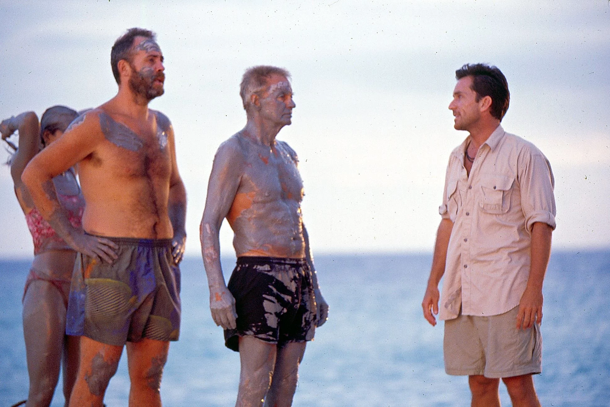

Reality TV has certainly had its moment during the pandemic. The earlier months had a number of hit new series such as Tiger King, Love is Blind, and Too Hot to Handle, and older series such as 90 Day Fiance have received an influx of new followers. I’ve hopped onto the trend as well, having watched more than half of the 40 seasons of Survivor over the past year.

Despite its large fanbase, reality TV has always been considered somewhat of a guilty pleasure for most folks. At best, you have fans who say that they know what they’re watching is trash and they’re ok with that. At worst, you have elitists who refuse to watch any reality TV or only watch it ironically because they expect there is no value to be gleaned from it. We’ve been told over and over again that reality TV is not something the educated gentry is supposed to watch - it’s instead entertainment in it’s basest format. The generic pop of the TV world, unable to rise to any level of meaningful sophistication.

Because of that I was surprised that I heard a critic mention Anthony Bourdain’s Parts Unknown as auteur reality television. I had never associated Parts Unknown with reality TV, and even then, the relatively consistent format of the show seemed to imply some mass produced nature. However, after thinking through the show more, the designation made more and more sense to me. The show explores topics that both have an existing relationship with high culture through its culinary focus and its sometimes exotic locales. Furthermore, Bourdain’s fingerprints are all over the program - not only is he the host, but his interests in journalism and sociological issues are highlighted just as much as the cuisine. He clearly holds a lot of editorial power, and he wields that to create a very cohesive experience.

However, Parts Unknown doesn’t typically fall under the reality TV umbrella in people’s heads for a reason. Oftentimes, such “worthwhile” shows seek to avoid the denotation altogether, instead lumping themselves under other tags like Informational Series or Nonfiction Programming (a literal translation of reality TV). As a result, the term reality TV seems to have hit a ceiling - any program that rises above middle-brow status escapes the terminology and becomes something different. And while the signifiers of brow-ness are definitely artificial and collapse under any serious critique, one cannot disregard the generally negative reputation reality TV carries. All that has led me to question whether reality TV can hope to escape its reputation and become something bigger. To put things in a different way, what’s stopping reality TV from being taken more seriously by tastemaker critics?

Interestingly, the roots of reality TV arguably lie in a subset of arthouse documentary filmmaking - cinéma vérité and direct cinema. These sects, which emerged in the 1950s and are still highly active today, aim to capture the human experience as it happens with minimal editorial intervention. Instead of having narration over clips, allow subjects to speak for themselves. Include longer shots to highlight that there’s relatively little cutting going on. Aspirationally, try to remove in the viewer’s mind the idea that there is a director at all.

Of course, it’s impossible to create a coherent narrative with pure raw footage, so editing and directorial sway is always needed to ensure that certain messages are highlighted and that users experience some kind of revelation. The films of contemporary cinéma vérité phenom Frederick Wiseman are masterclasses in this art. Wiseman's topics follow a simple theme - he takes an institution that the public at large benefits from, such as state congress, a large metropolitan hospital, or the public library, and he gives insight into its mechanisms with lightly edited footage of meetings and bureaucratic procedures. He takes the abstract notion of human politics, a core aspect of the human experience, and depicts how it manifests itself in reality. The viewer always leaves with both an understanding of the grandeur of the institution but also how institutional problems can prohibit progress or entrench outdated notions. In doing so, Wiseman’s films act as a more true view into the workings of American life and the day to day actions that allow it to happen.

The origins of reality TV inherited the same sense of wanting to portray life as it happens. MTV’s The Real World, which is often cited as the first instance of modern reality TV, was inspired by the docuseries An American Family, which chronicled the daily life of an affluent Californian family. In a similar way to cinéma vérité, the programs use relatively light touches, focusing on long conversations and day to day minutia. Interestingly, The Real World was initially thought to be too boring - proof that the average person’s life wasn’t particularly entertaining. Drama and intrigue aren’t derived from loud arguments or corny romantic tension. Instead, they are derived from each cast member’s life, as we go through their struggles finding work and meaning. While there is certainly conflict in interpersonal relationships, it never rises to the level we expect from modern reality television. Rather, the shows tried to genuinely explore the human condition and the uncertainties about identity, companionship, and meaning that we all face. While this lack of conflict may have been unsustainable for a long running entertainment program, the life conversations that were shown were quite tender and reminded me of conversations I had in dorm rooms at 3AM.

Even as reality television has transformed from the naivety of The Real World to the bombasity of The Bachelor and 90 Day Fiance, we still continue to see programs that aim to examine the human condition through unique yet nuanced lenses. Naked and Afraid shows humans at their most primal - it’s Hatchet brought to life, an exploration of the gritty survivalist nature most humans have lost. The aforementioned Parts Unknown highlighted a love of food that is generally shared across all cultures while teaching the viewer about culture and how it intersects with both ancient and modern politics. It’s clear that reality TV can offer a fresh perspective to topics frequently tackled in highbrow media, so where are the attempts to do so?

In that regard, I actually think that the early seasons of Survivor perfectly matched this high-minded notion of art. The show was framed as a social experiment, and voting people out was a relatively minor part of the experience. Instead, the point was to imagine how people from vastly different backgrounds would live together and create a new society. In order to navigate the survival elements, Richard Hatch’s lifestyle quickly proved to work well with Rudy’s valuation of hard work despite their cultural differences. Joel’s chauvinism quickly earned him the ire of his peers and resulted in his boot. While the competition aspects of the show certainly added Machivellian elements, they primarily served as a framing of what kinds of personal attributes contribute to a peaceful society. And when contestants were voted off, they were for the most part treated with dignity. Their struggles were highlighted and explained, and even if a viewer disagreed with the decision, they were always clued into why it was made. There wasn’t an incentive for the editors to dunk on individuals or turn them into wacky characters - they just wanted to document events as they happened.

As the show went on, it continued to dig more into its social experiment roots. Christy Smith was added to Survivor: Amazon to increase awareness of deaf communities, and Chad Crittenden’s successes in Survivor: Vanuatu showed that amputees can overcome their limitations as well. The show genuinely tried to document what a microcosm of a truly cosmopolitan American society would look like and the conflict and camaraderie that would naturally result from any reasonably large group of people. The addition of the competition element helped nudge these relationships in ways that highlighted struggles with morality, empathy, and insecurity that are deeply relatable to the viewing audience. While Mark Burnett certainly has a complicated legacy, I do attribute a lot of the beauty of these earlier seasons to his belief that unique stories would come out of the circumstances of Survivor. When broken down, early Survivor has all the tools needed to serve as an examination of the human condition.

Ultimately, Survivor campiness lent it a certain pop appeal that both caused its popularity and caused it to be disregarded by critics. Furthermore, the events of 9/11 and the resulting backlash towards entertainment furthered the stigma Survivor faced as a non-serious investigation of society. However, the original seasons showed that reality TV can avoid the pitfalls of modern virality-driven editing. Casting can seek out genuinely average people who aren’t looking to become entertainment superstars, and the natural banter that develops whenever you put people together in a room is intrinsically interesting.

The recent rise in popularity of quieter shows such as Terrace House gives me hope that there is still interest in the beauty of someone’s day to day life and their relationships with other people. While it is impossible to talk about Terrace House without bringing up the unfortunate outcomes that resulted from fan backlash in the most recent season, the earlier seasons captured a similar feel to cinéma vérité. We watched people just live their life without a strong incentive to create dramatic tension, and interesting narration still arose.

Overall, as nuanced and enlightening scripted dramas can be, both cinéma vérité and reality TV have shown time and time again that there is a certain weightiness that comes with watching things unravel in the real world in real time. I’m confident that reality TV can rebound towards a depiction that is more true to a shared human experience, and while doing so, it can also provide a framework that brings forward unique views of individuals and their place in the world.
