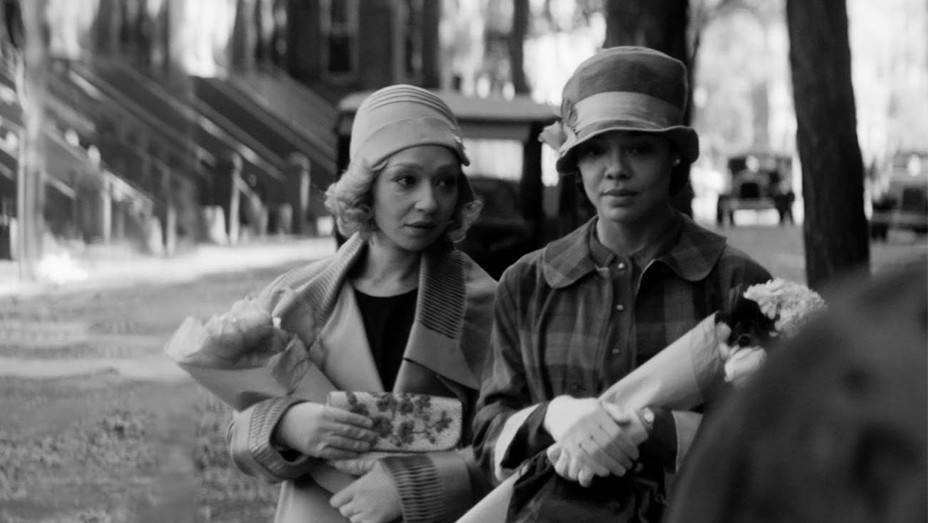

## Intro

Like many people, because of Sundance's decision to host the festival digitally this year, I was able to experience Sundance for the first time. Sure the format was different, and nothing can replicate the feeling of seeing an amazing movie with an enthused crowd, but the digital screening format certainly had its benefits. Having more flexible watch times and not having to worry about busing from theater to theater allowed me to binge through a ton of films, and there was some really good stuff this year.

With the benefit of a full festival pass, I was able to watch 34 films over the week. Before hopping into my thoughts on each of them, I do want to briefly note some of the themes I noticed from the festival. First, Sundance heavily focused on representing underrepresented voices this festival. 50% of films were directed by females, while 51% were directed by people identifying as POC. In addition, other marginalized groups were highlighted. *CODA* is a touching depiction of a deaf family, *Flee* is an excellent piece to add to the refugee canon, and *Luzzu* was a beautiful glimpse into Maltese culture. Props to Tabitha Jackson for not only navigating the digital world of the pandemic, but also finding ways to break down structural barriers in the world of cinema. I hope that other festivals, particularly US-based ones, follow Sundance's example in the future.

Secondly, many films in the festival featured beautiful cinematography and shot composition, but some of these films neglected the storytelling aspects. This has been the trend for a while now, as there is far more democratized knowledge of photography technique nowadays. Additionally, film Instagram and film TikTok kind of have a reputation for pushing a lot of aesthetically appealing directors such as Wes Anderson and Wong Kar-wai. Those directors are fantastic, but they succeed by combining their beautiful shots with thematic elements. The style contributes to the substance. Films such as *One for the Road* (WKW produced) and *Censor* stand out to me as having a ton of style but poorly constructed or overly trite stories backing them. Still, I do appreciate a well stylized film on the merits of beauty independently, and I obviously prefer beautiful but mediocre films over ugly and bad films.

Lastly, Sundance has had for quite some time now the reputation for featuring a ton of sappy coming-of-age stories, with some of the bigger hits being films like *Napoleon Dynamite*, *Little Miss Sunshine*, and *Call Me By Your Name*. This year had its fair share - *Together Together* and *Marvelous and the Black Hole* among others, but it also featured in the main dramatic competitions some more weird stuff, such as *On the Count of Three* and *The Pink Cloud*. However, in the end, classic sappy stories still wowed the audience, with *CODA* sweeping the awards by grabbing the Grand Jury, Directing, and Audience awards alongside a Special Jury award for ensemble cast. Perhaps it's another symptom of 2020 and the pandemic, an era where good news and heartwarming stories being hard to find. Regardless, *CODA* definitely deserves the praise it has received.

With all that out of the way, here are my thoughts on each film I had the chance to catch. I'll have shorter notes for most films, but then the end will have longer thoughts on my three favorite films from the festival.

## The Rest

#### Ailey

A fine documentary that I personally never really connected with. Ballet is not my cup of tea, especially more modern variants. I liked the content regarding Alvin Ailey's significance as an icon for multiple communities as well as the editing that showcased both Ailey's groundbreaking performances and his lasting impact. However, I never found myself getting that invested in the topic.

#### All Light, Everywhere

A unique examination of mass surveillance. Brilliantly synthesizes three different views of the issue - a historical analysis of the quantification and categorization endemic to the prison system, a tour of taser/body cam manufacturer Axon, and the product cycle of a satellite tracking tool. Creates a compelling view of how we got to our current sensor-based world with mostly raw footage and the occasional voice-over.

#### Amy Tan: Unintended Memoir

A retrospective on Amy Tan's works and the happenings in her life that drove them. However, the documentary does not benefit much from the film format, and many sections feel like they would have been better experienced by reading her 2017 memoir. I appreciated the focus on *The Joy Luck Club* and Amy's earlier life though. Sadly James Redford's final film before his unfortunate passing.

#### The Blazing World

A magical realism mystery which tries to take what was already an appropriately sized short film and expand it to a full feature. The hypothetical key frames and images that are scattered throughout the film are visually compelling, but the rest of the execution connecting these shots is sloppy. An attempt to capture the wacky adventurous feel of *Coraline* or *Alice in Wonderland* that fails due to bad acting, under-budgeted CGI, and a virtually non-existent plot.

#### Censor

An interesting concept piece centering on a British horror film censor and her gradual descent into madness. The retro aesthetic drives the film with some absolutely gorgeous shots and aspect ratio swaps. However, the more interesting themes of government censorship get put to the wayside by an ambling plot that is neither novel nor sufficiently integrated with the retro theme.

#### CODA

A by-the-book sappy coming-of-age story that manages to improve upon genre tropes by focusing on a unique cast of characters. *CODA*'s deaf family and its singing daughter have fantastic chemistry, and their love and co-dependence on one another creates both compelling drama and heartfelt moments. Only teared up a few times.

#### Cryptozoo

*Cryptozoo* holds a lot of promise at first sight - its unique animation style and ability to draw upon thousands of mystical creatures from various cultures seem like they would make *Cryptozoo* one of a kind. However, the film doesn't embrace its weirdness enough in my opinion, choosing to use those elements only as a veneer for an otherwise traditional story that feels like it would belong in a Disney movie ripoff.

#### Flee

A uniquely intimate look into the struggles an Afghani refugee had to go through to escape persecution in his home country. Uses stronly stylized animation to provide anonymity for the subject, allowing Amin to describe in detail the sights and sounds of post-war Russia, coyote smuggling trails, and eventual destination Denmark.

#### Hive

A dramatic telling of the real story about a cabal of Kosovan women who were forced to take their monetary matters into their own hands after their husbands were victims of regional political turbulence. The depiction of sexism, terror, and sisterhood succeeds in conveying how much the women had to struggle to find success in their ajvar business, but it gets so muddled up in the logistics of how the business works that the character moments that are suppose to be shocking don't feel sufficiently powerful when they arrive.

#### Homeroom

Homeroom follows a group of Oakland high school students in their quest for racial justice in a heavily policed area. The film doesn't have enough capstone moments to drive the drama forward, but fascinating characters manage to fill the holes. The film highlights insightful and competent youth leaders who have both sharp insight into societal problems and the motivation and charisma to fix them. It's hard not to feel optimistic about Gen Z after watching the documentary.

#### In the Same Breath

A documentary that I'm sure will be frequently referenced not long in the future, when we more closely examine the government failures that led to the incredibly prolonged COVID-19 lockdowns that are being seen across the world. *In the Same Breath* cleverly contrasts China's authoritarian approach to covering up COVID's impact with America's more laissez faire approach and the political tension that has resulted.

#### I Was a Simple Man

A Hawaiian take on art house ghost stores that examines a man's death and the complex family network that he leaves behind. Unfortunately, the film tries way too hard to be transcendental through vaguely philosophical-sounding sound bites and long lingering scenic shots. The character moments and ghostly happenings mostly fall flat, and the supernatural structure feels papered-on.

#### Jockey

Yet another entry in the "old expert retires after passing learnings to the next generation" series of dramas, this time focusing on horse racing. Doesn't add much to the genre, but there are some beautiful shots of races alongside some fantastic acting. That being said, I generally enjoy these kinds of movies, and Jockey hit all the right story beats to keep my eyes glued to the screen.

#### Judas and the Black Messiah

A well deserved late addition to the festival and a genuinely thoughtful and reflective addition to the Black canon. Daniel Kaluuya and Lakeith Stanfield both deliver phenomenal depictions of Fred Hampton and William O'Neal respectively, and the film's screenplay is filled with appropriately motivated action and well written dialogue. The film also does an amazing job capturing the tension of the late '60s political environment.

#### Luzzu

A dramatic look at decreasing economic security in less-developed island countries. A Maltese fisherman must find new ways to hustle after his precarious occupation is no longer enough to provide for his family. Themes of environmentalism, technology, and industrialization are layered on top of an already compelling personal narrative. The film captures the tension of reconciling traditional Maltese culture with increasingly globalized values and industries.

#### Marvelous and the Black Hole

Another coming-of-age story, this one focusing on a girl's trauma from her mother's death and her recouperation through a relationship with an eccentric magician. A decent supporting cast adds moments of levity and heartfelt love. Embraces genre tropes an appropriate amount with a standard car ride scene and a sappy climax. Will be perfect as a fun feel-good movie once it's on streaming platforms.

#### Mass

One of the better single-room dramas I've seen recently, but ultimately feels like it would have been better off as a theater production. The film depicts the attempt at reconciliation between the parents of a school shooter and the parents of one of the victims. The writing is a bit too clean for the incredibly messy topic, but the acting delivers with the assistance of well done close-ups and brilliant monologues.

#### One for the Road

Arthouse version of *The Bucket List.* A disgruntled trust fund baby and part time bar owner flies back to Thailand to help his terminally ill friend apologize to his past partners, only to learn more about himself and his own wants and desires. WKW's production influence is very clearly felt in the cinematography, but the aesthetics lack the polish and the thematic cohesiveness of WKW's films. Additionally, the melodramatic and overwritten story doesn't quite click together. The attempt at a diptych story structure feels more like a bad homage than a creative choice.

#### On the Count of Three

A one of a kind story about two friends who decide to tackle their remaining regrets before a joint suicide. The tone feels like a more humorous touch on Safdie brother-esque drama, and for the most part, the screeplay works. The slowly unraveling reveal of each of the main characters' personal problems is surprisingly fun to watch, and the banter between them is infinitely enjoyable.

#### The Pink Cloud

A 2019-filmed drama about the hypothetical scenario of a global pandemic forcing everyone to stay indoors. To cope, two people who were just hooking up when the apocalypse happened get to know each other inside and out and find very different ways of coping with their new reality as years pass. A piece which has shockingly fresh insights into isolation despite being released to a world where isolation is the norm.

#### Prisoners of the Ghostland

Sion Sono and Nicolas Cage both take their over the top styles and create a spaghetti western *Mad Max*. The film is full of immersive world details ranging from signs of every language and aesthetic style to clock-worshiping cults. Unfortunately, I think the film only goes over the top visually and in some very memorable one-liners, whereas I wanted the weirdness to provide more of a semblance of importance and insight.

#### Rita Moreno: Just a Girl Who Decided to Go For It

Rita Moreno's own takes on how she's changed over the course of her life give this documentary a strong sense of progression and momentum. Through her eyes, the viewer is able to see how Hollywood has changed. We see Rita's experiences with MGM, Marlon Brando, PBS, and other such notable entertainment landmarks, and I genuinely felt after the film that her invovlement was crucial in creating modern Hollywood. Rita's vital role in driving minority representation and a gradually increasing sense of racial authenticity is beautiful to see.

#### R#J

A re-envisioning of Romeo and Juliet that envisions the classic as a race war in southern California. The film relies heavily on a gimmick where scenes are viewed entirely through either Instagram live or text message. To contrast with this modern framing, the dialogue uses a mixture of modern slang and Shakespearean metric. Unfortunately, the gimmicks only hinder the film after their novelty wears off, and the viewer is left with a mostly stock retelling of the already well-trodden story.

#### The Sparks Brothers

A retrospective on the long music career of the brothers behind the band Sparks and their influence on music throughout the years. While the documentary does a fantastic job demonstrating just how inventive the duo has always been, the various interviews with past band members and Edgar Wright himself distracted from the core of the film.

#### Street Gang: How We Got to Sesame Street

A nostalgic look at the early days of Sesame Street, focusing on the new ground the series broke in children's TV, racial representation, and much more. It's fascinating to see how the series was able to facilitate such creativity while keeping its educational core, and knowing how much attention was paid to the scenes of my childhood gives me a newfound appreciation for the long-lasting show.

#### Summer of Soul (...Or, When the Revolution Could Not Be Televised)

Questlove's decision to let the music and audience of the Harlem Cultural Festival of 1969 speak for itself for the most part is what makes this documentary special. In between scenes from the concerts, interviews simultaneously provide context for the music and demonstrate palpable enthusiasm for the culture of the times. The happiness and love of music emanates from every scene of the documentary, and it's hard not to leave with a giddy smile.

#### Superior

Superior is a fun dark thriller about a women who moves in with her twin sister and her husband after getting in an altercation with her own husband. The two engage in classic Parent Trap swapping shenanigans as they both face the impact of the choices they made during very different life paths. The story is a bit dull, and some moments don't feel well built up or motivated, but it's mostly a fun ride throughout.

#### Try Harder!

This documentary focuses on a quintet of students at San Francisco's Lowell High School and their concerns about the college admissions process. The film does a good job in immersing the viewer in the complex combination of competitive one-upping and motivating camaraderie at the school, but it disregards many of the racial controversies that have plagued Lowell recently. Instead, it stumbles into a vaguely anti affirmative action position.

Read my more thorough review of Try Harder! [here](https://letterboxd.com/dwei/film/try-harder-2021/).

#### Users

Users is a beautiful look at how technology may potentially negatively impact future generations. There are amazing shots of the underwater cables that power the internet and futuristic vertical farms. However, ultimately, Users feels like it's that person on Twitter who is just asking broad rhetorical questions, and the aesthetic beauty of the film isn't able to mask the shallowness with which it approaches its topic.

#### We're All Going to the World's Fair

An experimental look at online culture and the ways in which it can potentially exacerbate our loneliness and isolation. Casey is a lonely teenager who gets wrapped up in the world of an internet copypasta, creating gradually more disturbing videos partaking in the trend over time. Along the way, a creepy older man eggs her on, and the two form an uncomfortable relationship. I love the premise behind the film, and the execution is mostly there. However, I think the camera lens isn't quite as insightful as I would like it to be, and the characters feel too much like caricatures of 4chan dwellers.

#### The World to Come

Period piece lesbian dramas are evidently very in right now. *The World to Come* certainly stands as a quality film own it's own right though by taking a unique approach. Instead of focusing too much on the chemistry between the lead actresses (though that chemistry is there), the film highlights their incredibly insecure husbands and the toil of the 19th century upstate New York world around them. The heavy use of diary fragments gives the film a somewhat Woolfean feel in it's lyrical yet ambling voiceovers. The result is a beautiful meditation on patriarchy and jealousy with the right amount of melodrama.

#### Writing With Fire

A pretty generic documentary on an incredibly interesting topic. The film focuses on an all female run newspaper in Uttar Pradesh, the content they create, and the community that results. The film occasionally creates glimpses into facets of Indian society I find incredibly interesting - the lack of voice for lower caste citizens, the culture's failure to create consequences in rape cases, and the eccentricities of local politicians. However, the film moves from topic to topic too quickly, never letting the emotions truly settle.

## Top 3

#### Cusp

Strong emotional yet intimate moments don't often naturally happen in documentaries. We're used to seeing them at the climax of every slice of life drama or in intense moments in our own lives, but it's rare to see authentic life moments happen in an organic manner on camera. Cusp is crammed full of them. The documentary catalogues a summer spent with three teenage girls in rural Texas, following them through arguments with their parents, typical teenage banter, and youthful relationship talk. Isabel Bethencourt and Parker Hill let the teenagers and their lives speak for themselves, with minimal editing and a steady camera.

Through that lens, the viewer is able to truly feel like they are with the teens on a daily routine of aimless adventures and chatter. Texan culture is highlighted through target practice excursions, trips to the beach, and hangouts in rooms decorated with Confederate memorabilia. We see everything from soccer games to alcohol and drug fueled parties with older boys. What seems like a troubling yet fantastical life to my coastal elite self is just a normal day for the girls.

The film is at its best during the many incredibly intimate moments. When a girl breaks up with her boyfriend for rape-related reasons. When another girl tries to protect her sister from an abusive father. When, to solidify their bond, the girls get bootleg nipple piercings. In all of these shots, the camera lingers for a long time, making it impossible not to empathize with the girls and hope they find something better.

Given this unobtrusive stance by the filmmakers, it's easy to question their decision not to intervene in some of the more sketchy moments. To wonder how they could see the girls go through such painful and private moments, capture them on film, then display them to a mass audience. To be honest, I don't think the film should have been made. But as it exists, independent of its creation process, *Cusp* is a beautifully done film that depicts teenage life with a level of honesty that simply can't be recreated in a fictionalized setting. 

Read my complete thoughts on Cusp in my [Letterboxd review](https://letterboxd.com/dwei/film/cusp/1/).

#### Passing

*Passing* immerses the viewer in 1920s Harlem in so many different ways. The story, an adaptation of a 1929 novella, examines race conditions through its depiction of two white-passing childhood friends. One has married into upper class society, weaponizing her whiteness, while the other one has become a cornerstone of the Harlem community, hosting frequent parties that bring together various cultural phenoms in the area. After the friends reunite, they go through their own internal journeys coming to terms with Black culture via jealousy for one another.

The story sounds incredibly modern in some ways - it doesn't hurt that 2020's *The Vanishing Half* and other similar books have brought the topics of passing and code-switching back into the cultural conversation. However, *Passing* embraces its history and source material through its use of black and white photography and excellent set and costume design. The themes of the film even seem to be inherited from the era, with 20s style overt yet nuanced metaphors and symbols being thrown all over the place. These themes may seem shallowly addressed by modern standards, but I can't fault director Rebecca Hall for choosing to mostly stick to the source material, especially when the pure temporal consistency gives the film a concrete identity.

*Passing* also succeeds largely in part due to a fantastic crew behind the film. Ruth Negga and Tessa Thompson are excellent leads, capturing many idiosyncrasies of the era in their vocal performances and posture. Blood Orange provides beautiful piano backings that both feel natural alongside the photography and appropriately build tension. The film's momentum sags a bit towards the end, and some characters could have benefited from having a bit more time, but overall, *Passing* has a passable story and an amazing aesthetic that make for a more than enjoyable viewing.

#### Together Together

*Together Together* has a ton of flaws. Some of the dramatic arguments feel a bit unwarranted. References to Woody Allen and *Friends* feel out of place and distract from other, better dialogue. Some characters feel too much like caricatures at times. However, I couldn't stop myself from squealing in glee at many parts of the movie.

The story is a somewhat novel take on common rom-com tropes. The main twist is that the two leads have an explicitly platonic relationship. Matt is a single man looking to have a child, and Anna is the surrogate mother who offers her services to him to fund her education. Despite awkward conversation at first, the two form an unlikely bond depicted through touching moments like choosing a color for the nursery, shopping for a crib, and picking an appropriately gender-neutral and non-emotional fake name to call the child during the process. A well-written script forms the bedrock for the story, with Matt's overprotective nature combining surprisingly well with Anna's witty callousness.

In addition, Ed Helm and Patti Harrison have superb chemistry as the leads, and given Harrison's rising superstar status in the LGBTQ community, I'm inclined to believe her the film a plethora of queer fans. The banter between the two is both hilarious when needed and a solid point of contrast to the more heartfelt moments. I was definitely tearing up by the end of the film, and I'm sure *Together Together* will become a staple part of my rotation of feel-good movies once it's in wider release.