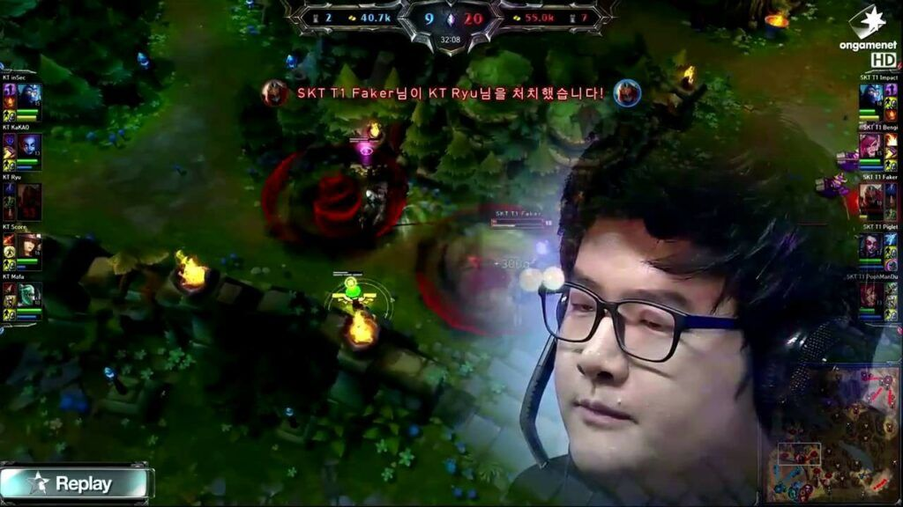
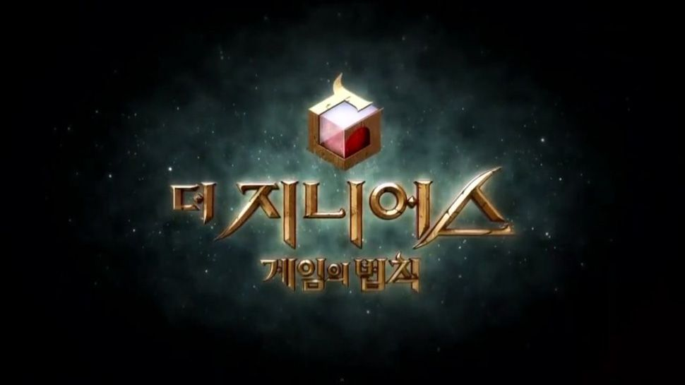

As esports and streaming have become more mainstream fixtures, new entrants in the entertainment world have been learning how to keep viewers consistently entertained. In particular, for live competitions in games such as chess or League of Legends, it can be hard to have buzz-worthy moments every week that give viewers the impulse to tune in for the big tournaments and series that producers spend their time building up. In any competitive endeavor, there's always some intrigue around who will win that will draw some viewers, but if competitors don't win in flashy ways, content can become stale, and viewers will over time drift to other productions.

To combat this issue, producers and game designers have found a few ways they can keep things fresh for the viewers. Fancy visuals and high quality special effects such as slo-mo replays in sports and striking particle effects in video games help highlight truly one of a kind plays. Balance patches and evolving metagame strategies can create moments where genius ideas are put on full demonstration. Strong personalities can draw eyes on their own through entertaining commentary and well-produced content - Hikaru Nakamura for example has helped revitalize interest in a centuries-old game.

While these improvements certainly create legendary moments and long lasting memories, conventional live entertainment methods still suffer from high variance in excitement levels. You can set up player narratives and team story lines in advance, but at the end of the day, if the games themselves aren't exciting, then viewers won't tune in. The risk of boring gameplay can only be mitigated so much, especially if you don't have the ability to frequently change the rules of the game. League of Legends, for example, has suffered from steadily declining viewership of its professional league despite considerable investments in flashy mechanics and high production narration. Many have attributed this decline to the lack of real rivalries in the scene - reasons to watch outside of the standings of the current season. Even though content teams try to prop up new rivalries, if fans don't buy into the narrative, there is no story to be told.

Fundamentally, most of these problems occur for two reasons. First, the games occur live. No matter how much setup is done in advance to create flowcharts of stories to spin and players to praise, if the games don't lend themselves to one of these scripts, not much can be done. Secondly, the core mechanics of the games don't change over time, meaning that there can be diminishing returns for viewers as they watch the same type of content every time. As mentioned, smaller tweaks can be made in rules and mechanics, but the games are designed in a way such that they aren't solve-able. If they were, the games wouldn't have a long lasting competitive scene, like how there isn't a competitive scene for the solved game of Connect 4. While this makes sense if the goal is to maintain longevity of a single game, it isn't necessarily great for viewers. Many of the best moments of game entertainment come from seeing players develop exciting strategies that seem unbeatable. The initial discovery when first put on display gets the community chatting, and while such strategies need to be fixed to ensure long term competitive integrity, the initial novelty they provide creates excitement that can't be matched.

The Korean variety show The Genius is cleverly fixes these problems in a way which creates consistent excitement for TV from episode to episode. The show is a survival style show where each week, several games are played to determine who will be the eliminee. There is a huge amount of variety in the games. Some are more in the vein of social deception games like Mafia or Werewolf, while others are pure strategic games like chess or shogi. The Genius subverts conventional gaming production in two ways. First, it leans into the variety in its games. Each week provides new puzzles to solve for the contestants as they learn the rules of the games and their implications. Secondly, because episodes are filmed six weeks prior to broadcast, editors are given plenty of time and context about who the important characters are and what the important narratives will be both in individual episodes and throughout the season. They can use this foresight to more clearly plot character growth arcs and downfalls accordingly.

To better show how The Genius leverages these aspects, let's take a look at one particular episode. In Season 2 Episode 7, the game of the week is God's Judgement. At the beginning of the game, players are given two die with unique pips. They're told that for each of ten rounds, they must roll two die. Before the rounds, they bet on two numbers. Each round the sum of their die is one of those numbers, they get a point. At first, the game seems totally based on luck - it's all up to God's Judgement. However, players learn that they can buy die with their in game currency, and the purchasable die are more consistent. Players quickly begin figuring out which dice can be purchased and what the distributions are for various combinations of die to maximize their winnings. The tension is set up to lead the viewer to believe that the player who is best at calculations and has sufficient luck will win the game.

This precedent is soon turned on its head though when 10 minutes before the rolling begins, one player figures out that the die can be split in half. Different halves of the die can then be recombined to create different pip combinations on each side. Once this news gets out, all the players begin to frantically break and rotate their die, once again searching for a combination which has the most consistency. This time though, the search space is much higher. There are several different die, each dice has two halves, and each half can be rotated in one of four ways. With so little time remaining, the viewer is led to believe that the player who figures out the best combination in that time span will win. And when one player, Junghyun, creates a combination that has a 66% chance of hitting a 7 or 8 then high rolls a total score of 9, the result seems all but certain.

It is then that another player, Sangmin, strolls in and conspicuously tries to only bet on one number: 11. And as Sangmin rolls his die, he keeps hitting 11 over and over, getting a perfect score of 10.  It's revealed that Sangmin has one dice with six on every side and one dice with five on every side. The story then flashes back to only a few minutes after the game began, when Sangmin figured out the secret to the die long before anyone else. His early discovery gave Sangmin plenty of time to create two perfect die, solidifying him an easy victory.

The episode exemplifies how The Genius strays from conventional gaming entertainment. First of all, the game has no replay value. Once people know that the die can be broken in half, everyone can get consistent results with relatively minimal effort. Because God's Judgement is only every played once though, the act of figuring out the trick provides more than enough entertainment for the episode. The entertainment is than doled up in the editing room in a way to purposefully mislead the viewer, allowing for reveals that completely transform the narrative. Non-conventional timelines are used to pace discoveries in an order which continuously compounds. Rather than chronologically following every character at once, the edit presents developments around knowledge of the die in a progressive sequence, from most obvious to least. This progression creates constantly rising action as new twists about the die are revealed, and the narrative climaxes when Sangmin uses his perfect die. Finally, there is a satisfying conclusion when Sangmin's efforts lead to his decisive victory and immunity for the week. By combining these two techniques, the producers of The Genius are able to provide an episode which follows a more traditional drama-like narrative path that is crafted specifically to give the viewers surprising and memorable moments.

Of course, The Genius is a unique show, and its format would not necessarily work for every form of game-based entertainment. However, I do think that producers should experiment with some of these non-standard techniques. Game designers should be less afraid of having blatantly broken builds in their games. As long as these builds don't stick around for too long, they can briefly enable incredibly fun gameplay. Secondly, competitive leagues shouldn't operate under the assumption that viewers want to watch live gameplay on Twitch. Perhaps the next Smash Summit should film everything in one batch then tinker with footage in the editing room to play up certain rivalries and victories. In general, we seem to have inherited from traditional sports an assumption that people want to see scores update in real time and sit in stadiums to cheer their favorite players on. There will always be a market for that, but I'm a strong believer that everyone is looking for narrative, and while narrative can certainly be applied ad hoc, nothing is quite as satisfying as a carefully crafted tale of heroes and villains, alliances and betrayals, and unbelievable moments that aren't just amazing gameplay, but also capstones to broader epics.